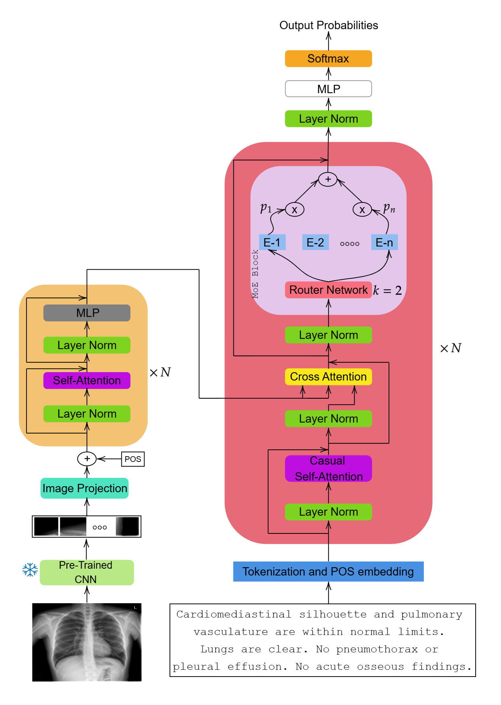

# MoERad: Mixture of Experts for Radiology Report Generation

This is the implementation of MoERad that was submitted as part of [ReXrank](https://rexrank.ai/) Leaderboard. We have trained and evaluated two variants of the MoERad model on IU-Xray dataset. The models' predictions on IU-Xray and the corresponding CXR-Metrics scores can be found in the `results/iu_xray` folder. The model generates only the "Findings" part of the report.

## Download Model Checkpoints
The code requires the following checkpoints to generate reports: `pretrained_BCL.pt` and `MoE_model-IUXray.pt`.

You can download the `pretrained_BCL.pt` and `MoE_model-IUXray.pt` checkpoints from this [Google Drive link](https://drive.google.com/drive/folders/1CtzPf39mpvpW6l3l6UcfbP6ghGVkpshX?usp=sharing). Once downloaded, please place all the three files in the `models` folder.

## IU-Xray Test Split Evaluation Score
| Model | BLEU (↑) | BERT Score (↑) | Semb Score (↑) | RadGraph Combined (↑) | 1/RadCliq-v1 (↑) | RATE Score (↑) | GREEN (↑) | 1/FineRadScore (↑) |
| :---: | :---: | :---: | :---: | :---: | :---: | :---: | :---: | :---: |
| MoERad-IU | 0.277 | 0.525 | 0.641 | 0.341 | 1.922 | 0.684 | 0.665 | 0.587 |

## ReXGradient Private Split Evaluation Score
| Model | BLEU (↑) | BERT Score (↑) | Semb Score (↑) | RadGraph Combined (↑) | 1/RadCliq-v1 (↑) | RATE Score (↑) | GREEN (↑) | 1/FineRadScore (↑) |
| :---: | :---: | :---: | :---: | :---: | :---: | :---: | :---: | :---: |
| MoERad-IU | 0.227 | 0.434 | 0.446 | 0.247 | 1.018 | 0.575 | 0.494 | 0.468 |


## Run Inference
Please update the defaults of the following Args in the `inference.py` file as per your preference:

`--input_json_file`, `--save_json_file`, `--img_root_dir`, and `--chkpt_path`.

`inference.py` also supports ArgumentParser. You can also pass the above Args as CLI during the file run. Either way will work. 

In the terminal based on the dataset for which you need to predict the reports, please execute any of the following two commands. This would generate reports for CXR Images in the test split of the corresponding dataset.

(a) IU-Xray

```
python inference.py --input_json_file "data/iu_xray/ReXRank_IUXray_test.json" --save_json_file "results/iu_xray/MoERad.json" --img_root_dir "<PREFIX PATH TO FILES>" --chkpt_path "models/MoE_model-IUXray.pt"
````

This would result in a `MoERad.json` file in the path specified in `--save_json_file` that contains predicted reports. 

Once this output JSON file is created, please run the `evaluation_script.py` file to create `gts.csv` and `preds.csv` files with sample-wise ground truth and predicted reports, respectively. Before running the file, please update the variables: `input_json_file`, `GT_REPORTS`, and `PREDICTED_REPORTS` per your preference.

## MoERad Architecture
 

## Acknowledgement
This work inherits code from [BCL](https://github.com/FlamieZhu/Balanced-Contrastive-Learning) and [Build nanoGPT](https://github.com/karpathy/build-nanogpt). We extend our gratitude to them.
